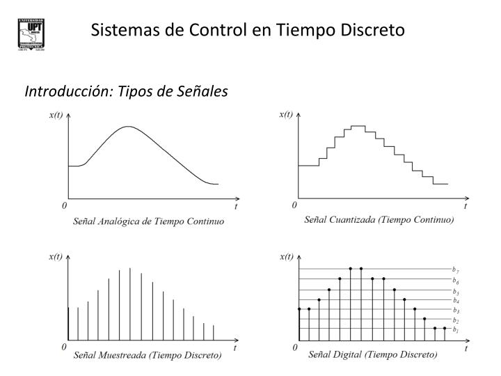

# Sistemas de control
Un sistema de control es un conjunto de dispositivos encargados de administrar, ordenar, dirigir o regular el comportamiento de otro sistema, con el fin de reducir las probabilidades de fallo y obtener los resultados deseados.

Los sistemas de control son agrupados en tres tipos básicos:
1. Hechos por el hombre.
2. Naturales
3. Control predictivo.

Dentro de los multiples sistemas de control que existen, se encuentran los denomidados sistemas de tiempo dentro de los cuales existen sistemas continuos y sistemas discretos
Un sistema es de tiempo continuo, si el modelo del sistema es una ecuación diferencial, y por tanto el tiempo se considera infinitamente divisible. Las variables de tiempo continuo se denominan también analógicas.

